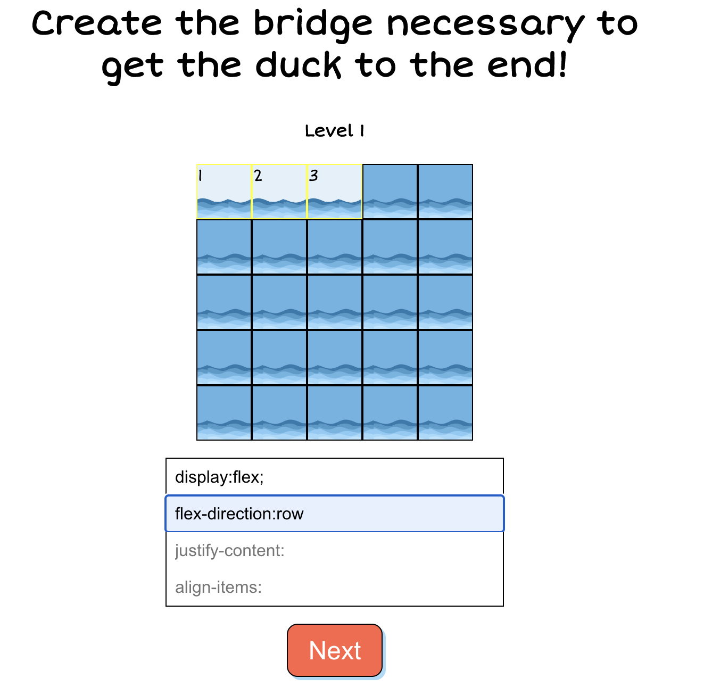

# 🐥FlexDuck🐤
 Hackathon project within a team of two software developers.  Flexduck was created to teach new front-end developers how to utilize
 the css layout model, flexbox. Flexduck will teach you the
 flexbox directions, justify content, and align items.  Paired programming, github repos, and strong communication were used to implement this project between two 
 developers who had not previously known each other.

## 🚀 Deployed

[Flex duck challenge!](https://flexduck-challenge.netlify.app/)

## 📸 Images/Demo

## 💻 Built with
<li>React</li>
<li>Javascript</li>
<li>Sass</li>

## 🛠️ Installation Steps:
1. To start using this app you first need to clone the repository:

    git clone git@github.com:Team-PST/flexduck-challenge.git

2. Then you will need to install all the required packages for the application. Run this command (if you're using npm):

    npm i

3. Run the frontend with the following command in the folder:

    npm start
    

## 🔮 Future Plans for 🦆FlexDuck

<li>Add more flexbox challenges</li>
<li>Add levels</li>
<li>Add Obstacles(for space between)</li>
<li>Increase board size and allow them to choose parent div choosing drag click</li>
